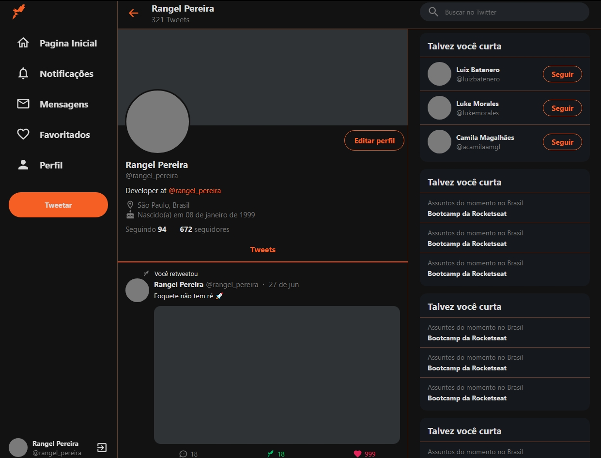

<h1 align="center">
UI Clone - Twitter
</h1>

<p align="center">Este projeto foi desenvolvido para fins de estudo, 
  o projeto trata-se de um clone da interface da rede social Twitter contando com responsividade e tecnologias atuais.</p>

<p align="center">
  
  <br/>
  <br/>
</p>

<hr>

<p align="center">
  
<p>

## Aprendizado
O projeto foi criado com intuito de praticar a responsividade, exercitando assim conhecimentos em cálculos de largura e altura em CSS, trabalhando justamente com flex-box e
diversos conceitos que ajudarão na responsividade de futuros projetos que estarei desenvolvendo. Também foi praticado o TypeScript com intuito deaumentar a produtividade no projeto


## Tecnologias Utilizadas

- [X] ReactJS
- [X] TypeScript
- [X] Styled Components


## :arrow_forward: Como executar

_com **npm**_

```bash
# Instalar dependências
$ npm install
# Iniciar servidor
$ npm start
```

_com **yarn**_

```bash
# Instalar dependências
$ yarn
# Iniciar servidor de desenvolvimento
$ yarn start
```

---
